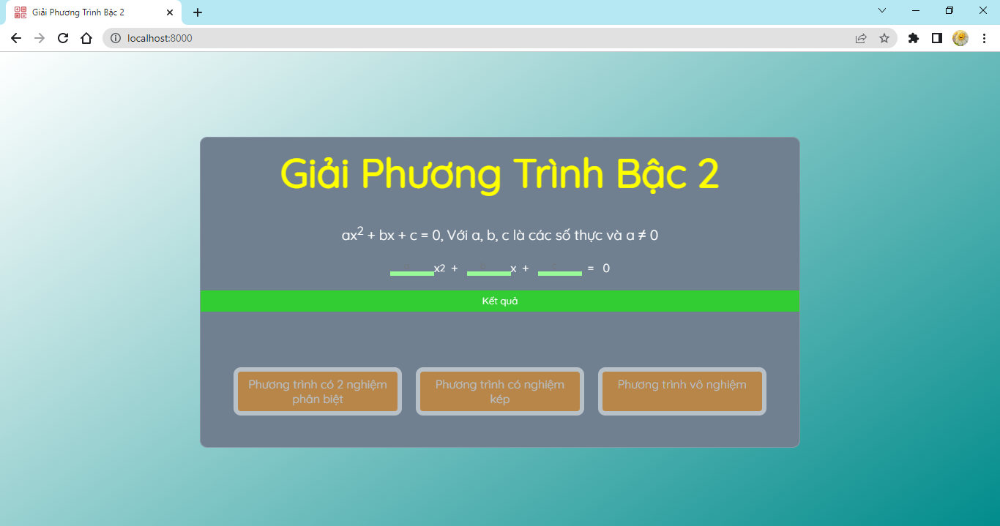
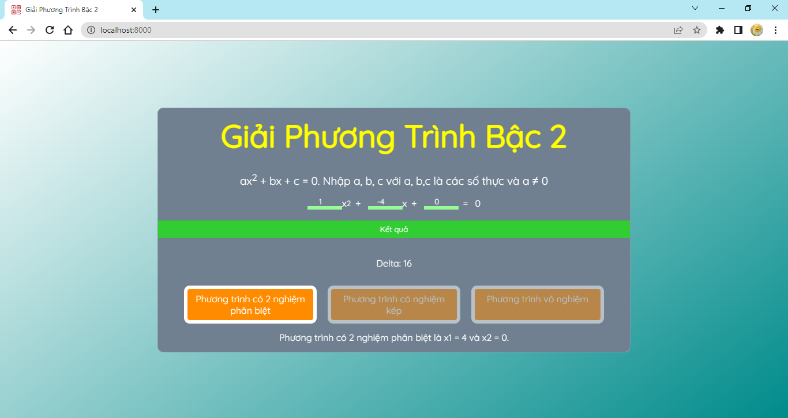
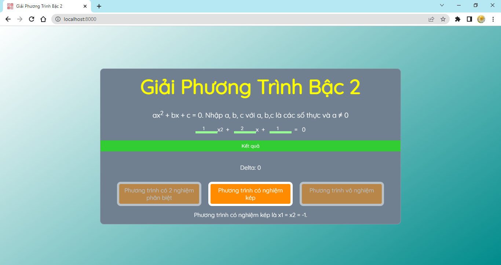
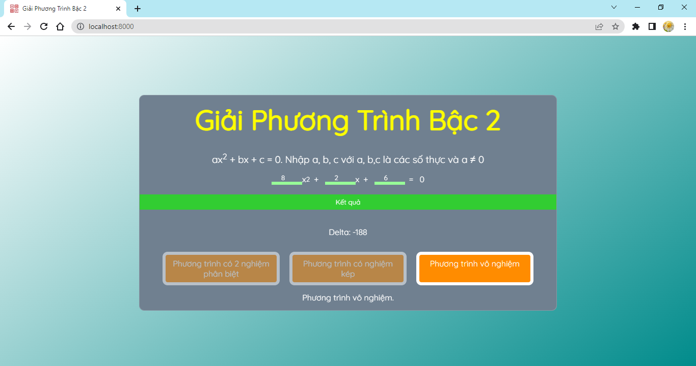

# Quadratic-Equation-Solver

## Here are some screen shots

  
   
  
   
  
   
  

 

 ## Cloning this repositary
 1. Open **Git Bash**.
 1. Change the current working directory to the location where you want the cloned directory.
 1. Type `git clone git@github.com:iris-mygh/GiaiPhuongTrinhBac2.git`
 1. Press **Enter** to create the clone of this repositary.

 

